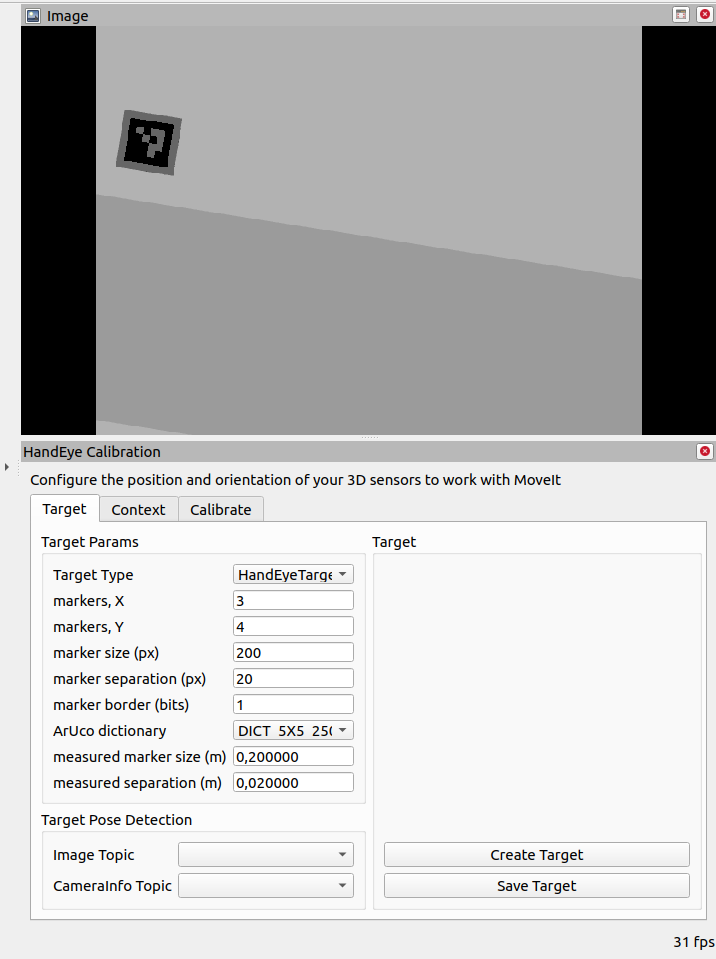
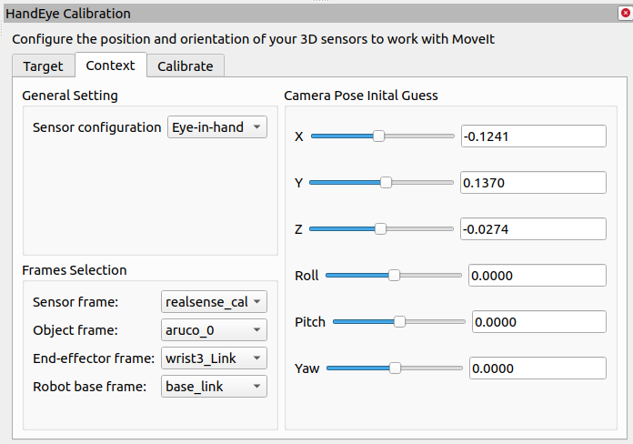
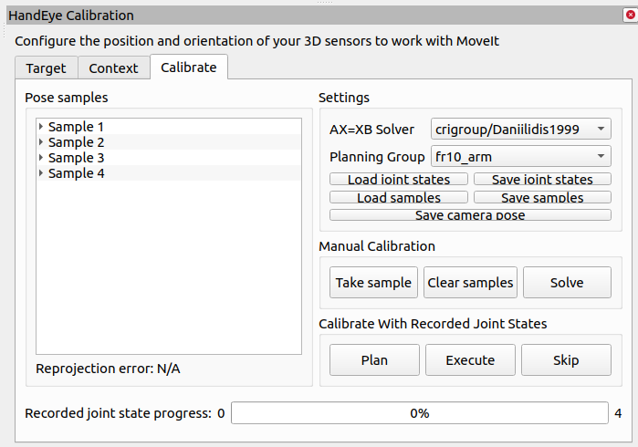
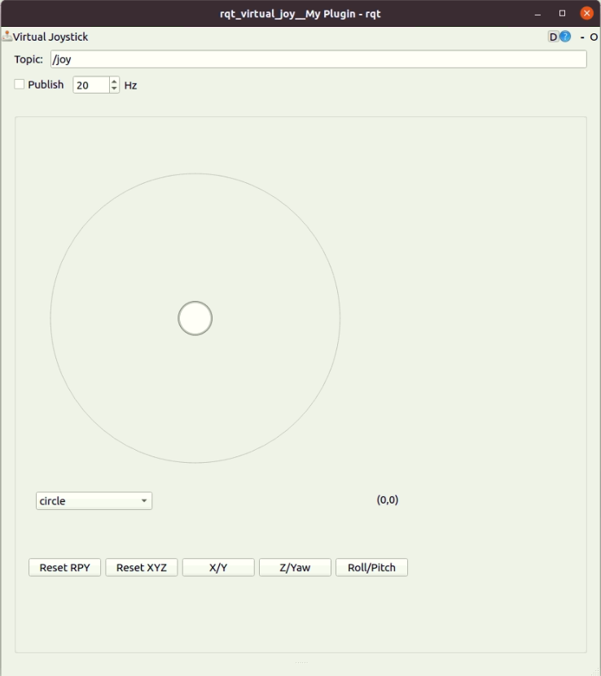
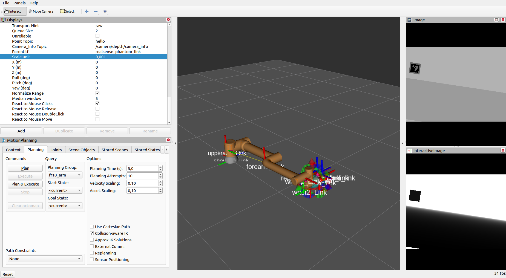

# frcobot_ros

This repository is dedicated to providing comprehensive resources and tools for working with ERACOBOT manipulators. 


#### Install a virtual box in your PC (optional)

I will provide some recoureces for windows users. If you are using Linux then you can skip some guides.

See the instruction from another resources to install virtualbox with Ubuntu 20.04

https://www.virtualbox.org/wiki/Downloads

If the problem appeard with permission for user:

open the terminal:

```bash
su root
nano /etc/sudoers
```
Write in there this codes
```bash
vboxuser ALL=(ALL:ALL) ALL
%vboxuser ALL=(ALL) ALL
```


Save the file and write "exit"

#### Install ROS

```bash
sudo apt update
```
```bash
sudo apt install git python3-pip python3-schedule -y
```
```bash
mkdir -p ~/catkin_ws/src
cd ~/catkin_ws/src
git clone https://github.com/TPODAvia/ROS1-installation.git
chmod +x ROS1-installation/ROS.sh
sudo ./ROS1-installation/ROS.sh
```
Do the script below only once:
```bash
echo "source /opt/ros/noetic/setup.bash" >> ~/.bashrc
echo "source ~/catkin_ws/devel/setup.bash" >> ~/.bashrc
source ~/.bashrc
source /opt/ros/noetic/setup.bash
```
Install libraries
```bash
sudo apt-get install python3-rosdep -y
sudo apt-get install libxmlrpcpp-dev
sudo apt-get install -y ros-noetic-rosparam-shortcuts ros-noetic-ros-control ros-noetic-ros-controllers ros-noetic-moveit -y
sudo apt-get install xterm
# sudo apt-get install ros-noetic-joint-state-controller ros-noetic-effort-controllers ros-noetic-position-controllers ros-noetic-velocity-controllers ros-noetic-gazebo-ros ros-noetic-gazebo-ros-control
```

```bash
cd ~/catkin_ws/src
git clone https://github.com/TPODAvia/frcobot_ros.git
git clone https://github.com/TPODAvia/aruco_pose.git
git clone https://github.com/TPODAvia/world_sim.git
git clone https://github.com/moveit/moveit_calibration.git
sudo cp ~/catkin_ws/src/frcobot_ros/frcobot_hw/lib/* /opt/ros/noetic/lib


cd ~/catkin_ws
source /opt/ros/noetic/setup.bash
sudo rosdep init

rosdep update
rosdep install --from-paths src --ignore-src -y

```

Compile the project
```bash
catkin_make
source devel/setup.bash
```

## Gazebo simulation

```bash
roslaunch fr3_moveit_config demo_gazebo.launch 
```
```bash
roslaunch fr10_moveit_config demo_gazebo.launch 
```

## Real robot simulation

```bash
roslaunch fr3_moveit_config demo_simulation.launch
roslaunch fr3_moveit_config demo_hardware.launch 
```

```bash
roslaunch fr10_moveit_config demo_simulation.launch
roslaunch fr10_moveit_config demo_hardware.launch 
```

## Spwan color boxes

```bash
roslaunch gazebo_ros_model_color spawn.launch
```

## How to use gripper?

```bash
# - gripper open
rostopic pub -1 /rh_p12_rn_position/command std_msgs/Float64 "data: 0.0"

# - gripper close
rostopic pub -1 /rh_p12_rn_position/command std_msgs/Float64 "data: 0.68"
```

You can use python to execute the command
```bash
rosrun fr10_moveit_config gripper_control.py
```


## Use moveit_python module

moveit_python is a set of pure-python bindings to the ROS interface of MoveIt! based on the
earlier moveit_utils package that was developed as part of the chess_player package.

[Working with moveit_python](moveit_python/README.md)

## Install mongo database
```bash
sudo apt-get install mongodb-server
sudo apt-get install mongodb-dev
sudo apt-get install ros-noetic-warehouse-ros
sudo apt-get install ros-noetic-warehouse-ros-mongo
```

## Working with moveit_callibration

Clone the project to the workspace
```bash
cd ~/catkin_ws/src
git clone https://github.com/moveit/moveit_calibration.git
mkdir ~/.ros/camera_info
cp ~/catkin_ws/src/aruco_pose/config/head_camera.yaml ~/.ros/camera_info/head_camera.yaml
cd ~/catkin_ws
rosdep install --from-paths src --ignore-src -y
catkin_make
source devel/setup.bash
```

Usage:
1) We can skip the `target` module as we use our own aruco detector. Note that there's bug of detecting aruco in `moveit_callibration` module



2) Set all needed data in `content` module



3) Take at least 5 samples in `calibrate` module



4) To move the manipulator in callibration mode. Load the yaml example file in rviz:
```bash
frcobot_ros/docs/moveit_callibarion.yaml
```

# Interactive usage using interactive image and joystick

The interaction is included in gazebo simulation, however, for testing puroposes can be run separately
```bash
roslaunch rqt_virtual_joy rqt_virtual_joy.launch
```

To move the tf we need to press the `Publish` button and by selecting any 3 buttons at the bottom, we can move the `joystick_tf` in 6DOF space.




To use the interactive screen, set all values that're corresponded to your environment, then to publish you need to click on the white pixel in the interactive image visualisation.

